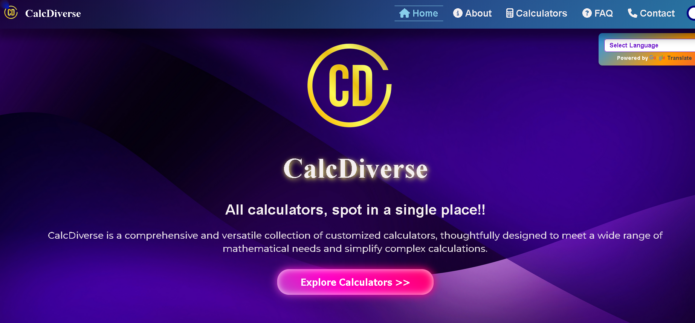
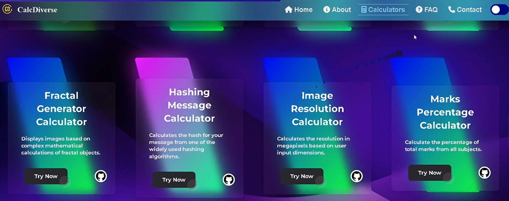
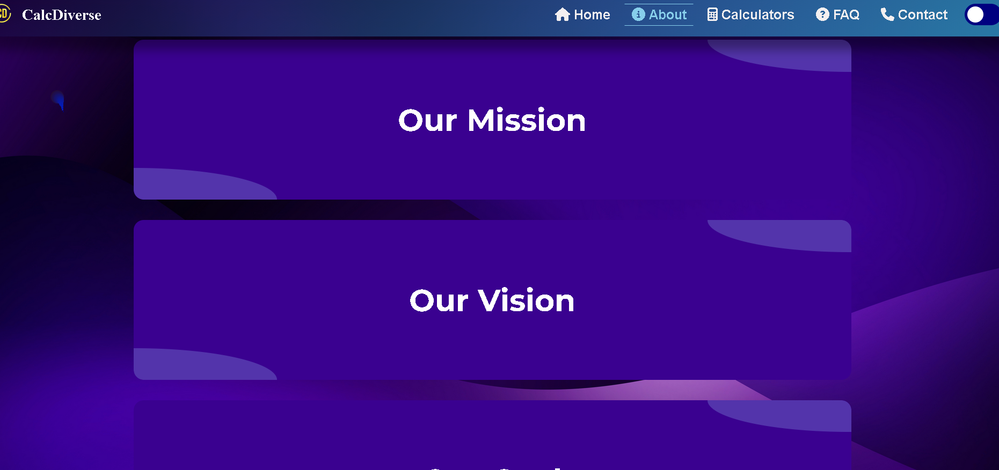

# <p align="center">✨CalcDiverse✨</p>
<!-------------------------------------------------->
<div align="center">
<p>
</p>
</div>

<!-------------------------------------------------->

<div id="top"></div>

<h2>Table of Contents🧾</h2>

- [Introduction📌](#introduction)
- [Technology Used🚀](#technology-used)
- [Overview⭐](#overview)
- [Getting Started💥](#getting-started)
- [Contributing Guidelines📑](#contributing-guidelines)
- [Code Of Conduct📑](#code-of-conduct)
- [Open Source Programs🥳](#this-repo-has-been-part-of-the-following-open-source-programs)
- [Project Admin⚡](#project-admin)

- [Contributing is fun🧡](#contributing-is-fun)
<br>

<!-------------------------------------------------->

<h2>Introduction📌</h2>

CalcDiverse is a customized collection of calculators for various aspects of mathematics. Individuals with basic web development knowledge can create distinctive calculators and submit pull requests.

<!-------------------------------------------------->

<h2>Technology Used🚀</h2>

<p>
  <a href="https://www.w3schools.com/html/"> </a>
  <a href="https://www.w3schools.com/css/"> </a>
  <a href="https://www.w3schools.com/js/"></a>
</p>
<p align="right">(<a href="#top">back to top</a>)</p>

<!-------------------------------------------------->

<h2>Overview⭐</h2>

<h3>Live Project --> (https://calcdiverse.netlify.app)</h3>


<h3>Home/Main Page :-</h3>
<br><br>


<h3>Calculators Page :-</h3>
<br><br>


<h3>About Page :-</h3>
<br><br>


<h3>FAQ Page :-</h3>
<br><br>


<h3>Contact Page :-</h3>

<br><br>
<p align="right">(<a href="#top">back to top</a>)</p>

<!-------------------------------------------------->

<h2>Getting Started💥</h2>

- Fork this Repository.
- Clone the forked repository in your local system.
```
git clone https://github.com/<your-github-username>/CalcDiverse.git
```
- Open `index.html` in your browser.
- View the [Live Project](" ") here.
- Raise an issue if you find a bug or add a feature.
- Wait for the issue to be assigned and proceed only after the issue is assigned to you.
- Add your codes :-

  - Create a new folder in the `Calculators` folder.
  - Put Your calculators code files in your newly created folder.
  - Add a `README.md` file in your new folder which includes Description, Tech Stacks, and Screenshots of that calculator.
  - Add your calculator's HTML file link in the main `index.html` by continuing a box section.

- Navigate to the project directory.
```
cd CalcDiverse
```
- Create a new branch for your feature.
```
git checkout -b <your_branch_name>
```
- Perform your desired changes to the code base.
- Track and stage your changes.
```
# Track the changes
git status

# Add changes to Index
git add .
```
- Commit your changes.
```
git commit -m "your_commit_message"
```
- Push your committed changes to the remote repo.
```
git push origin <your_branch_name>
```
- Go to your forked repository on GitHub and click on `Compare & pull request`.
- Add an appropriate title and description to your pull request explaining your changes and efforts done.
- Click on `Create pull request`.
- Congrats! 🥳 You've made your first pull request to this project repo.
- Wait for your pull request to be reviewed and if required suggestions would be provided to improve it.
- Celebrate 🥳 your success after your pull request is merged successfully.
<p align="right">(<a href="#top">back to top</a>)</p>

<!-------------------------------------------------->

<h2>Contributing Guidelines📑</h2>

Read our [Contributing Guidelines] to learn about our development process, how to propose bugfixes and improvements, and how to build to CalcDiverse.

<!-------------------------------------------------->

<h2>Code Of Conduct📑</h2>

This project and everyone participating in it is governed by the [Code of Conduct](https:github/CODE_OF_CONDUCT.md).
 By participating, you are expected to uphold this code.

<!-------------------------------------------------->

<h2>This repo has been part of the following Open Source Programs🥳</h2>

<table>


</table>
<p align="right">(<a href="#top">back to top</a>)</p>

<!-------------------------------------------------->

<h2>Project Admin⚡</h2>

<table>
<tr>
<td align="center">
<a href="https://github.com/sachingiri58"></a><br><sub><b>Sachin Giri</b><br><a href="https://www.linkedin.com/in/sachin-giri-657b98221/"></a></sub>
</td>
</tr>
</table>

<!-------------------------------------------------->


<!-------------------------------------------------->


<h3>Give it a 🌟 if you ❤ this project. Happy Coding👨‍💻</h3>
<p align="right">(<a href="#top">back to top</a>)</p>
